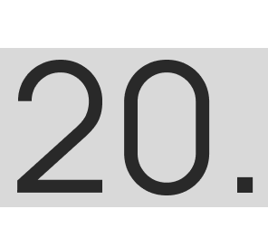
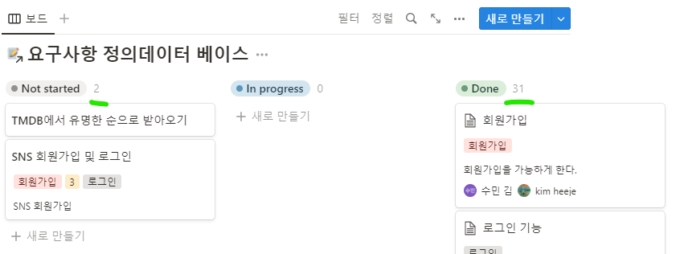
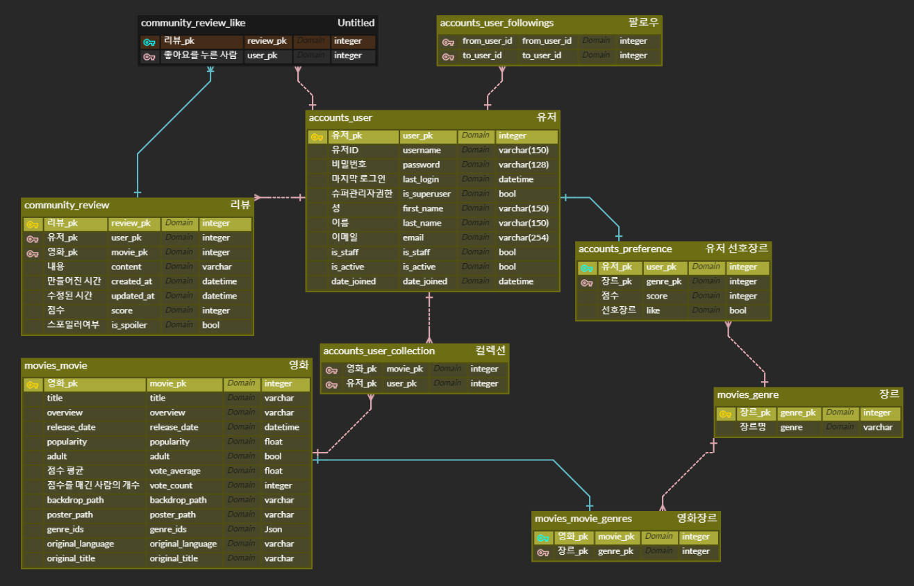
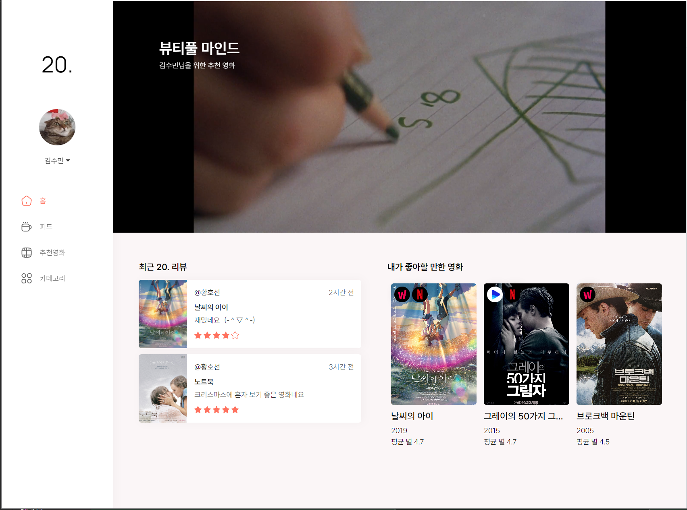
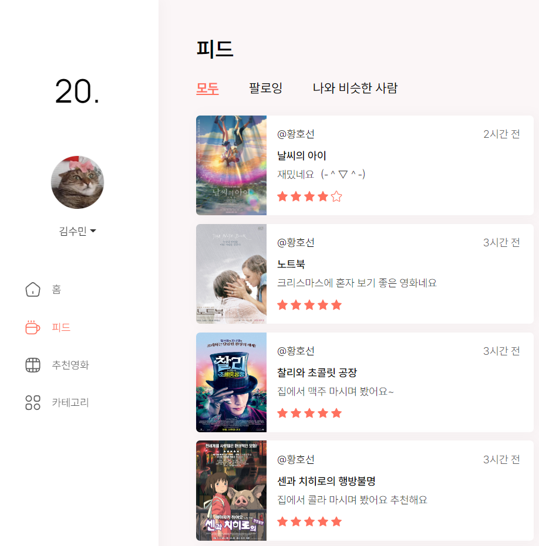
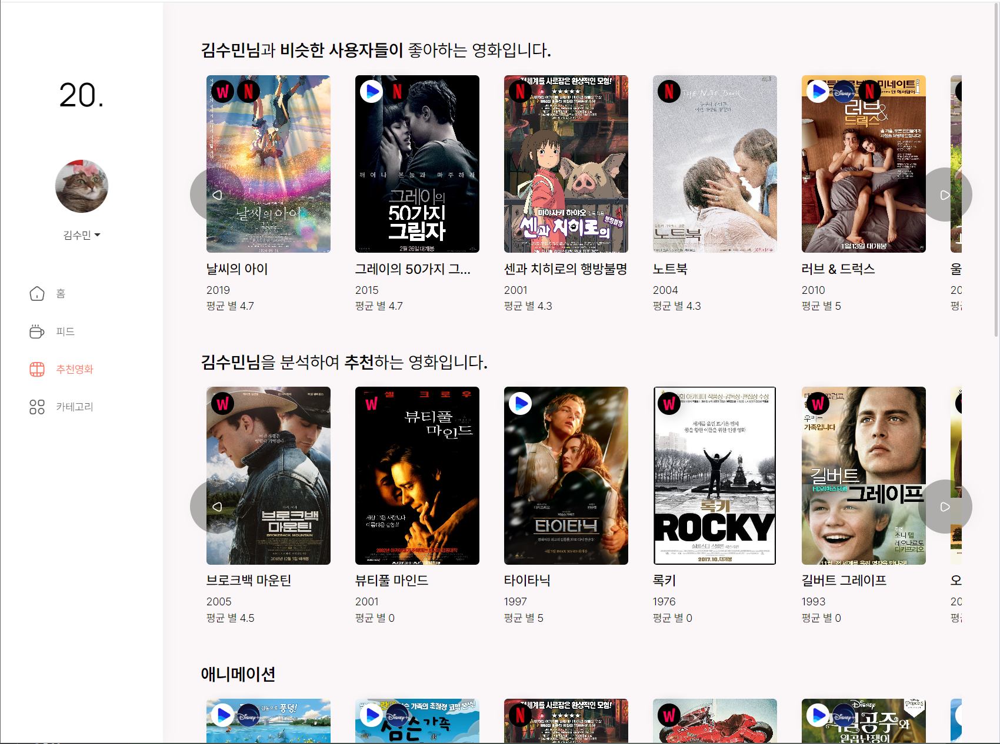
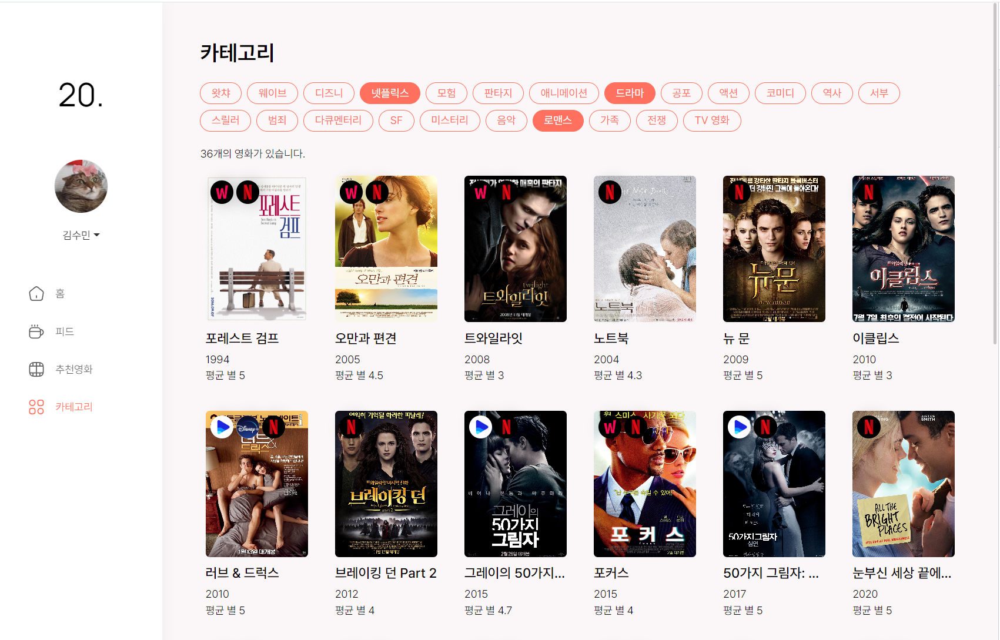
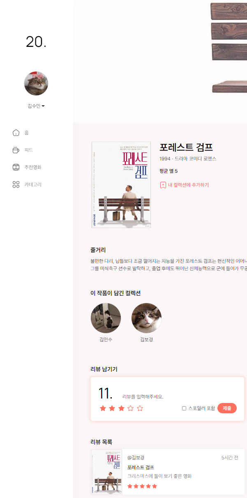
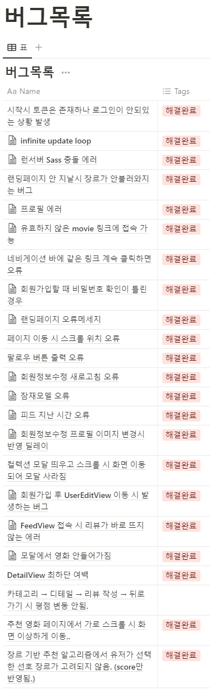

# 유사 사용자 기반 영화 추천 프로젝트 20.

---

유사한 사용자의 영화를 추천하는 사이트

### 기획배경: 

- 영화 추천 알고리즘을 유사한 사용자 기반 영화 추천을 하고 싶었다.

- 문제점 2가지:

  - 콜드스타트: 초기데이터 부족
  - 롱테일: 비인기 영화 추천 되지 않음

- 따라서 문제점을 해결하기 위해 **2가지 해결방안** 도입

  1. **리뷰를 쉽고 간편하게 공유할 수 있도록 20글자 제한을 둬서 올릴 수 있게 하였다.**

     > **20. 을 기획하게 된 배경**

  2. **잠재 모델 기반 알고리즘 추천 기능**

     - 부족한 콜드스타트와 롱테일을 보완하기 위한 추천기능,


## “20.”의 팀원 소개

---

| 김수민 | 김희제 |
| --- | --- |
| @nimusmix | @heisje |

## 기술 스택

---

- 커뮤니케이션
    - github
    - Discord
    - Notion
- 디자인
    - Figma
- 개발
    - Django
    - Vue.js
    - Node.js
    - html/js/scss

## 업무 분담 내역

---

백앤드/프론트로 구분하지 않고 기능으로 분리하되, 같이 진행하였습니다.

자세한 사항은: [노션링크](https://www.notion.so/77bdc6ac9d494c4d88db9c2812567884)에서 확인할 수 있습니다.

### 업무 분담 ‘메인’ 기능 담당자

비중이 높은 사람을 배정했습니다.

- 백엔드 :
    - 유저 : 수민
    - 데이터 가공 : 희제
    - RDBS : 수민
    - 유사 사용자 알고리즘 : 수민
    - 잠재 모델 알고리즘 : 희제
- 프론트 :
    - user : 수민
    - CSS : 희제
    - router : 수민

## 목표 서비스 구현 및 실제 구현 정도

---




### 목표 서비스 요소

- 데이터
    - ✔OTT를 구분할 수 있는 데이터
- 유저
    - ✔회원가입, 로그인, 로그아웃, 프로필 변경
- 홈
    - ✔유사한 사용자 기반 영화 추천
- 피드
    - ✔팔로워 팔로잉 기능
    - ✔영화별 리뷰
    - ✔유사한 사용자 기반 리뷰 추천
- 영화추천
    - ✔유사한 사용자 기반 영화 추천
    - ✔잠재 모델 기반 영화 추천
    - ✔선호 사용 장르 영화 추천
- 카테고리
    - ✔장르, OTT를 구분 filter 기능
- 디테일
    - ✔영화를 컬렉션에 넣은 사용자 보기
    - ✔컬렉션 모달 구현
    - ✔리뷰 쓰기 기능
- 기타
    - ✔라우터 가드
    - ✔다크모드 기능
    - ✔API 통신
    - ✔상태관리

## 데이터베이스 모델링 (ERD)

---

**

**받아오는 모델**: Movie, Genre

**API** : TMDB API

## 영화 추천 알고리즘에 대한 기술적 설명

---

### 1. 유사 사용자 기반 추천 알고리즘

1. 유저가 리뷰 남긴 영화가 내가 리뷰 남긴 영화 리스트에 있으면 점수 올리기
2. 그렇지 않으면 아직 안 본 영화 리스트에 추가
3. (점수, 유저, 아직 안 본 영화 리스트)
4. 점수 높은 순으로 정렬하여 10개를 자름.
5. 아직 안 본 영화 리스트만 추출
6. 아직 안 본 영화가 겹칠 때마다 해당 영화의 id를 key로 하고 value에 +1
   
    ### 코드
    
    ```python
    # 유사 사용자 기반 알고리즘
    @api_view(['GET'])
    def recommend_similar_user(request):
        all_information = []
        not_yet_list = []
    
        # 로그인한 유저가 리뷰 남긴 영화의 id
        my_review_ids = list(Review.objects.filter(user_id=request.user.id).values_list('movie_id', flat=True))
    
        # 모든 유저의 id
        user_ids = list(User.objects.values_list('id', flat=True))
    
        for user_id in user_ids:
            if user_id == request.user.id:
                continue
            
            score = 0
            not_yet = []
    
            # 해당 유저가 리뷰 남긴 영화의 id
            user_review_ids = list(Review.objects.filter(user_id=user_id).values_list('movie_id', flat=True))
            for user_review_id in user_review_ids:
                if user_review_id in my_review_ids:                                     # 유저가 리뷰 남긴 영화가 내가 리뷰 남긴 영화 리스트에 있으면 점수 올리기
                    score += 1
                else:                                                                   # 그렇지 않으면 아직 안 본 영화 리스트에 추가
                    not_yet.append(user_review_id)
    
            all_information.append((score, user_id, not_yet))                           # (점수, 유저, 아직 안 본 영화 리스트)
        all_information = sorted(all_information, reverse=True)[:10]                    # 점수 높은 순으로 정렬하여 10개를 자름.
    
        not_yet_list = list(map(list, zip(*all_information)))[2]                        # 아직 안 본 영화 리스트만 추출
        not_yet_score_dict = defaultdict(int)
        for not_yet in not_yet_list:                                                    # 아직 안 본 영화가 겹칠 때마다 해당 영화의 id를 key로 하고 value에 +1
            for movie_id in not_yet:
                not_yet_score_dict[movie_id] += 1
    
        not_yet_score_dict = sorted(not_yet_score_dict.items(), reverse=True, key=itemgetter(1))[:10]
        
        result = []
        for movie_id in not_yet_score_dict:
            movie = get_object_or_404(Movie, pk=movie_id[0])
            result.append(movie)
    
        serializer = MovieSerializer(result, many=True)
        return Response(serializer.data)
    ```
    

### 2. 잠재 모델 기반 추천 알고리즘

1. 선호장르와 조회수 점수 구하기
2. movie 하나를 구해서
3. 여러 장르를 구한다.
4. 점수 = (가중치 // 장르개수) * 장르수
5. 본 영화 제외하기
6. 10개를 잘라서 pk만 조립한다.

```python
# 잠재 모델 기반 추천 알고리즘
@api_view(['GET'])
def recommend_latent_model(request):
    user_preferences = get_list_or_404(Preference, user=request.user)
    score = dict()
    all_score = 0
    
    # 선호장르와 조회수 점수 구하기
    for user_preference in user_preferences: 
        score[user_preference.genre.pk] = user_preference.score
        if user_preference.like:
            score[user_preference.genre.pk] += 10
        else:
            score[user_preference.genre.pk] += 0
        all_score += score[user_preference.genre.pk]
    
    # 백분율 환산 -> 일단 패스(유의미한지 체크)
    # for genre in genres:         
    #     score[genre.pk] = score[genre.pk] * 100 // all_score

    # 영화와 비교하기
    movies = get_list_or_404(Movie)
    
    result_movie_scores = defaultdict(int)
    for movie in movies:  # movie 하나를 구해서
        # 여러 장르를 구한다.
        genres_len = movie.genres.count()

        # 점수 = (가중치 // 장르개수) * 장르수
        genres_id = list(movie.genres.values_list('id', flat=True))
        for genre_id in genres_id:
            result_movie_scores[movie.pk] += (score[genre_id] * 1000) // genres_len

    # 본 영화 제외하기
    # reviews = get_list_or_404(Review, user=request.user)
    reviewed_movies = list(Review.objects.filter(user_id=request.user.id).values_list('movie_id', flat=True))
    for reviewed_movie in reviewed_movies:
        result_movie_scores[reviewed_movie] = 0

    result_movie_scores = list(result_movie_scores.items())
    result_movie_scores.sort(key=lambda x:x[1], reverse=True)

    # 10개를 잘라서 pk만 조립한다.
    results = list(map(list, zip(*result_movie_scores)))[0][:10]
    
    # Movie모델로 바꿔주는 과정을 거쳐야한다.
    results_movies = list()
    for result in results:
        results_movies.append(Movie.objects.get(pk=result))

    serializer = MovieSerializer(results_movies, many=True)
    return Response(serializer.data)
```

## 서비스 대표 기능에 대한 설명

---

### 홈

- 1가지의 영화추천
- 최근 유사한 사용자 리뷰
- 내가 좋아할 만한 영화
  

### 

### 네비게이션

- 프로필이미지
    - 토글: 프로필/로그인/로그아웃/다크모드
- 홈
- 피드
- 추천영화
- 카테고리

### 피드

- 모두보기
- 팔로잉 보기
- 나와 비슷한 사람 보기
- 스포일러 방지 기능
- 



### 추천영화

- 유사 사용자 알고리즘 기반 추천
- 잠재 모델 기반 알고리즘 추천
- 내재 선호장르 기반 추천



### 카테고리

- OTT filter 기능
- 장르 filter 기능
- OTT overlay
- row-scroll movie card

### 

### 영화디테일

- 컬렉션 추가 기능
- 다른 사용자의 컬렉션 보기
- 리뷰 남기기 버튼



## 기타 (느낀 점, 후기 등)

---

### 느낀점과 후기

**백엔드**

Django

- 많은 양의 데이터를 구성하다 보니 백엔드의 데이터 초기 구성이 엄청 중요하다고 느꼈다.
- 후에 수정하기에는 너무 많은 API가 연동이 되어있어서, 쉽게 변경할 수 없기 때문에 한개의 API에는 한 개의 state에서 axios통신을 하는 방법이 어떨까? 생각이 들었다. 코드가 번잡할 지라도, 백의 구조가 변경될 경우를 생각안하고 작업한 것 같다.
- 정말 공을 들여 알고리즘을 짤 것이 아니라면, 역참조 등의 효과적인 코드를 아는 것이 중요하다고 생각이 들었다.

**프론트엔드**

CSS

- 초기에 컬러와 버튼과 폰트 등을 미리 세팅해 둔 것이 후에 다크모드를 만들 때 많은 도움이 된 것 같다. 하지만 후반에 급하게 짜는 css에는 이런 것을 다 적용하지 못하여서 아쉽다.
- 후반에 초기에 설정했던 css를 재사용하는 것이 쉽지않았다. 이를 해결하기 위해 scss를 정의해놓은 것을 import 해가며 원하는 것만 사용하는 방향성으로 갔으면 어떨까? 하는 생각이 들었다.

VUE

- 상태관리가 잘 안된 것 같다. 한 컴포넌트에는 한 기능만 넣자! 마인드로 시작했어서,  같은 url로의 axios요청이 많이 생성되어버렸다. 백의 변경에도 바로 대응 할 수 있도록 상태관리에 힘쓰자!
- component를 옮겨다니는 것이 너무 힘들었다. . 괜찮은 확장프로그램을 꼭 써야겠다.

**기타**

- JS와 Python의 데이터처리 방식에 대해 더 생각해야했다.
    - 예를들면, 영화의 데이터를 id를 key로 하는 딕셔너리 형태로 전달을 해서, 프론트에서 빠르게 처리하게 하는 방법
    - 그 후, serializer로 리스트가 원하는 id만 보내주어서 프론트 측에서 빠르게 찾는 방안 같은 것이다.
- 버그를 공유하며 진행을 하였지만, 너무 수많은 버그들이 생성되어 전부 기록하지 못하였다. 매우 유효한 버그의 경우 자세히쓰지 못해서 아쉽다..

